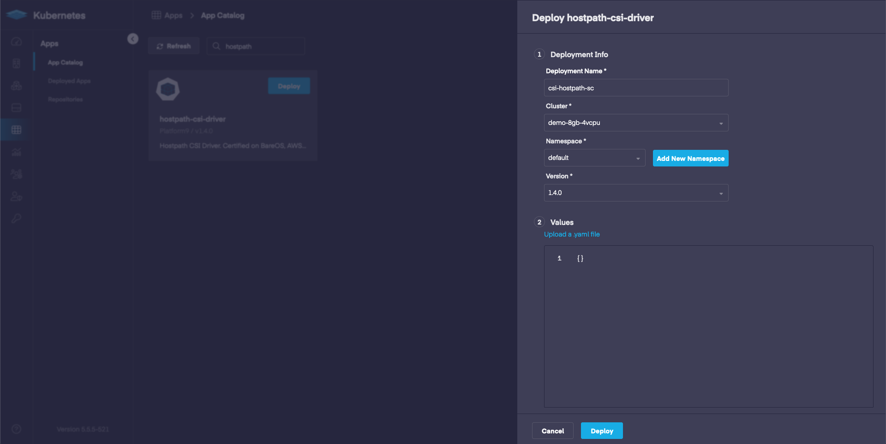
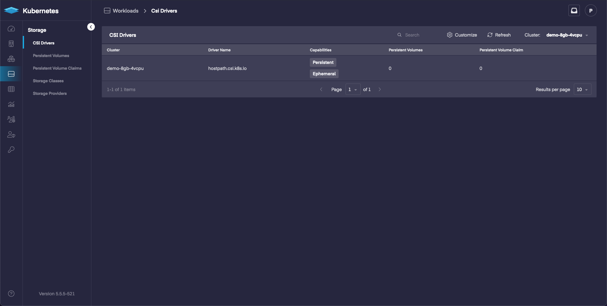
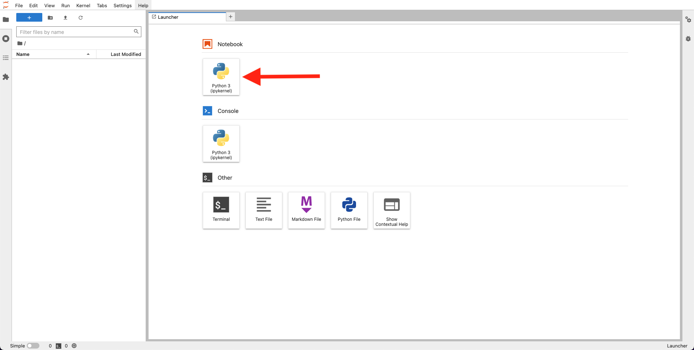
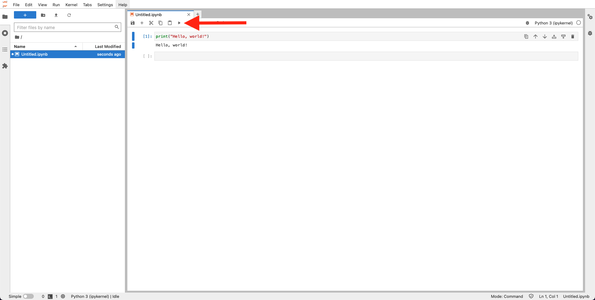
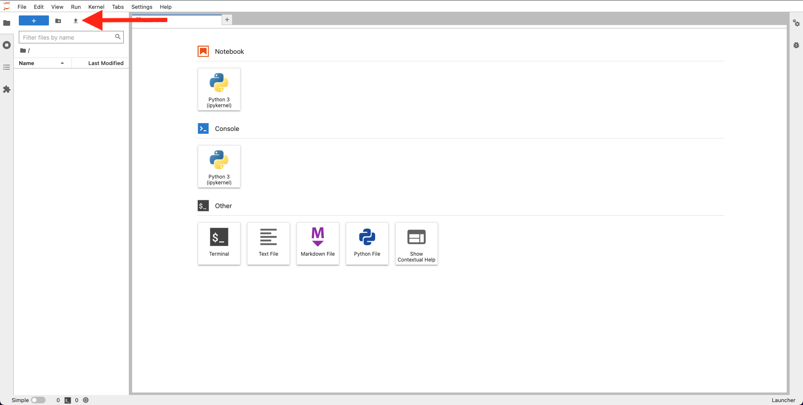
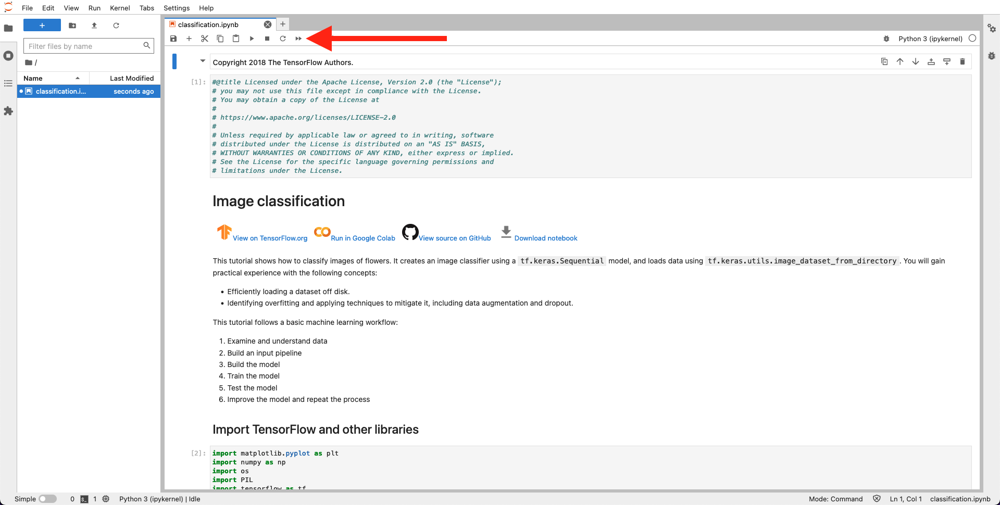
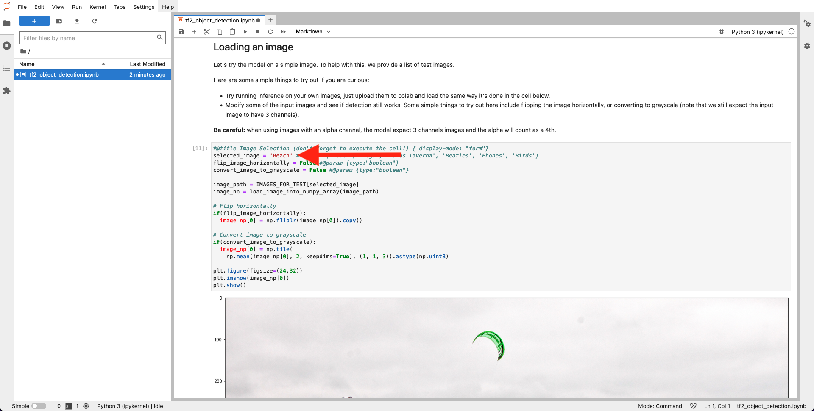
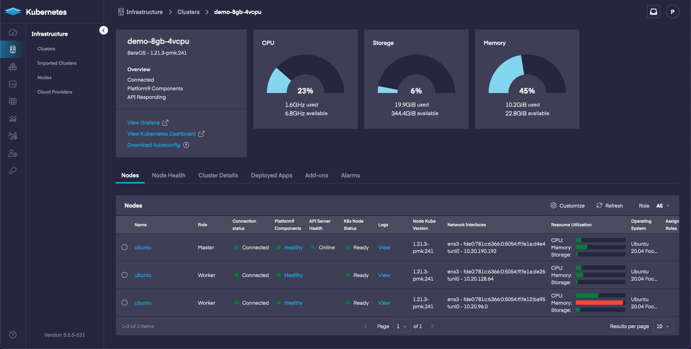

# Kubernetes Academy 101: AI/ML

## What to Expect

We will deploy a Kubernetes cluster using Platform9, deploy hostpath storage, and finally deploy a Jupyter notebook backed by persistent storage.

## Action Items

- Benefits for Machine Learning.
- Deploy a cluster with Platform9 Free Tier. (<https://platform9.com/signup/>)
  - We will deploy a BareOS Cluster
    - Platform9 uses the term ‘BareOS’ to refer to a set of physical or virtual machines in your on-premises infrastructure that have a supported linux operating system installed that can be used to create an on-premises Kubernetes cluster.
- Configure cluster storage with the CSI HostPath driver.
  - Deploy using the App Catalog.
- Deploying a Jupyter notebook in your Kubernetes cluster.
  - Deploy with the default container for Tensorflow (<https://jupyter-docker-stacks.readthedocs.io/en/latest/using/selecting.html>)
- Get information about the notebook using Kubernetes commands.
- Access the Notebook using a token.
- Run “Hello, world!” on your Jupyter notebook.
  - Create a new notebook and run Hello, World! Congrats, that was your first notebook on Kubernetes!
- Load an example Tensorflow Tutorial Notebook
  - Run the Notebook and update a section or two.

## Pre-requisites

- BareOS: Bare Metal or VMs running Ubuntu 20.04

- LoadBalancer or NodePort
  - LoadBalancer will require MetalLB being deployed when configuring the cluster.
  - NodePort will not require additional configuration during cluster deployment.

- Tested both of the Tensorflow examples with small VMs. The workers were 8GB Memory and 4 CPU nodes.
  - For faster results you may want to use larger VMs. The Workshop actually used 3 x 32GB Memory and 16 CPU nodes.
  - I would recommend 3 nodes with around 16GB+ Memory and 4+ CPU. Anything over this will help reduce the time it takes to run a notebook and support multiple notebooks running on the same nodes.
  - If you're running your own deployment/pod and are having issues with the kernel dying frequently, verify that you are adding the requests field with 1GB+ for memory.

```yml
resources:
  requests:
    memory: 1000Mi
```

## Kubernetes Benefits

Easily scale up Jupyter notebooks for your users. Give each user access to their own notebook so that they can experiment. Provide persistent storage so that users can save their work. Optimize server usage by allowing multiple workloads to run at the same time. Provide larger resource pools to users who may need more than what is provided locally (laptop/local compute).

Ideally after running a single pod for a Jupyter notebook for testing, we would progress to configuring JupyterHub (<https://zero-to-jupyterhub.readthedocs.io/en/latest/>) to help automate notebooks for our users.

## Deploy a Cluster with Platform9 Free Tier

We are going to start out by deploying a Kubernetes cluster using Platform9. Here is a view of the Dashboard, we will walk through a deployment using 3 Virtual Machines for this demo.


For installation information check out the links below. The same guide can be used for Bare Metal or VMs. We will want to 

- <https://platform9.com/docs/kubernetes/get-started-bare-metal>

We will access the cluster using kubectl, which means we will need to install kubectl (<https://kubernetes.io/docs/tasks/tools/#kubectl>)

## Configure Storage with the CSI HostPath Driver

Now that we have a cluster we will deploy a storage provider so that we can save our work.

This will be done using the App Catalog. The App Catalog will allow us to quickly deploy helm based applications.

We are going to walk through a simple storage deployment using hostpath. In a production environment you may consider using something like Rook + Ceph instead of hostpath.  This section introduces the App Catalog and options within it, such as being able to modify a default configuration with specific values.

Select the App Catalog option in the Menu.


Select Deploy on the hostpath tile. Fill in information such as the deployment name, namespace, and select the cluster.



Select the storage option in the menu and then CSI Drivers to view information about what we just deployed.



## Deploy a Jupyter Notebook

Create a deployment using jupyter/tensorflow-notebook. (<https://jupyter-docker-stacks.readthedocs.io/en/latest/using/selecting.html>)

Examples for two methods, NodePort and LoadBalancer.

At this point we can either clone the github repository (<https://github.com/Platform9-Community/ai-ml-workshop>) or you can download/copy the jupyter.yaml file from either the NodePort folder or the LoadBalancer folder under the ai-ml-101/ directory.

Once we have the file on our machine, or somewhere that can use kubectl to access the cluster, we can run:

`kubectl create -f jupyter.yaml`

## Access the Notebook

Once the notebook has deployed we can pull the logs to figure out the URL + Token. The Tensorflow image is around 1GB so it can take a few moments for the pod to move into a running state.

Assuming we are deployed in the default namespace, we can view the status of the pod using:

`kubectl get pods`

```bash
$ kubectl get pods
NAME      READY   STATUS    RESTARTS   AGE
jupyter   1/1     Running   0          31m
```

If the original yaml file was modified to use namespaces you would need to specify the namespace:

`kubectl get pods -n NAMESPACE`

Once the pod is in a running state we can view the logs:

```bash
$ kubectl logs jupyter
Entered start.sh with args: jupyter lab
Executing the command: jupyter lab
[I 2022-07-26 15:56:07.863 ServerApp] jupyterlab | extension was successfully linked.
[I 2022-07-26 15:56:07.882 ServerApp] nbclassic | extension was successfully linked.
[I 2022-07-26 15:56:07.885 ServerApp] Writing Jupyter server cookie secret to /home/jovyan/.local/share/jupyter/runtime/jupyter_cookie_secret
[I 2022-07-26 15:56:08.302 ServerApp] notebook_shim | extension was successfully linked.
[I 2022-07-26 15:56:08.347 ServerApp] notebook_shim | extension was successfully loaded.
[I 2022-07-26 15:56:08.350 LabApp] JupyterLab extension loaded from /opt/conda/lib/python3.10/site-packages/jupyterlab
[I 2022-07-26 15:56:08.350 LabApp] JupyterLab application directory is /opt/conda/share/jupyter/lab
[I 2022-07-26 15:56:08.359 ServerApp] jupyterlab | extension was successfully loaded.
[I 2022-07-26 15:56:08.367 ServerApp] nbclassic | extension was successfully loaded.
[I 2022-07-26 15:56:08.367 ServerApp] Serving notebooks from local directory: /home/jovyan
[I 2022-07-26 15:56:08.368 ServerApp] Jupyter Server 1.18.1 is running at:
[I 2022-07-26 15:56:08.368 ServerApp] http://jupyter:8888/lab?token=df6d103b0944468bec9eb658184548bdc66bf0cf6e1462a5
[I 2022-07-26 15:56:08.368 ServerApp]  or http://127.0.0.1:8888/lab?token=df6d103b0944468bec9eb658184548bdc66bf0cf6e1462a5
[I 2022-07-26 15:56:08.368 ServerApp] Use Control-C to stop this server and shut down all kernels (twice to skip confirmation).
[C 2022-07-26 15:56:08.373 ServerApp] 
    
    To access the server, open this file in a browser:
        file:///home/jovyan/.local/share/jupyter/runtime/jpserver-7-open.html
    Or copy and paste one of these URLs:
        http://jupyter:8888/lab?token=df6d103b0944468bec9eb658184548bdc66bf0cf6e1462a5
     or http://127.0.0.1:8888/lab?token=df6d103b0944468bec9eb658184548bdc66bf0cf6e1462a5
```

In the example above we are looking for the URL:

http://jupyter:8888/lab?token=df6d103b0944468bec9eb658184548bdc66bf0cf6e1462a5

- LoadBalancer

  If you are using a LoadBalancer then you can replace `jupyter` with the LoadBalancer External-IP:

  ```bash
  $ kubectl get service jupyter
  NAME               TYPE           CLUSTER-IP     EXTERNAL-IP     PORT(S)                                        AGE
  jupyter   LoadBalancer   10.21.161.60   192.168.86.10   8888:32765/TCP   35m
  ```

  In this example the IP would be the External-IP `192.168.86.10`. Our URL would end up being:

  http://192.168.86.10:8888/lab?token=df6d103b0944468bec9eb658184548bdc66bf0cf6e1462a5

  If you want to test this out more, and are going to keep redeploying with the same configuration, then you can create a record in /etc/hosts for `jupyter`:
  
  ```bash
  # Jupyter
  192.168.86.10	jupyter
  ```

  This would allow you to copy/paste from the container logs and use:

  http://jupyter:8888/lab?token=df6d103b0944468bec9eb658184548bdc66bf0cf6e1462a5

- NodePort

  If you are using a NodePort service then you will need to figure out the IP + Port to use to replace "jupyter":

  ```bash
  $ kubectl get service jupyter
  NAME      TYPE       CLUSTER-IP     EXTERNAL-IP   PORT(S)          AGE
  jupyter   NodePort   10.21.50.177   <none>        8888:30833/TCP   6s
  ```

  ```bash
  $ kubectl get nodes
  NAME            STATUS   ROLES    AGE    VERSION
  192.168.86.71   Ready    worker   174m   v1.21.3
  192.168.86.72   Ready    master   174m   v1.21.3
  192.168.86.73   Ready    worker   174m   v1.21.3
  ```

  We can build out our URL using an IP address from one of our nodes and the port from our NodePort service:

  http://192.168.86.71:32765/lab?token=df6d103b0944468bec9eb658184548bdc66bf0cf6e1462a5

## Hello World! Example

Now we can create our first notebook. We'll start out with a Python3 Notebook, which shows up in the dashboard. Click the Python 3 (ipykernel) option under Notebook. This will create a new notebook.



In the next screen we'll add "Hello, world!" to the first box and then select "Run the Selected Cells and Advance".

```python
print("Hello, world!")
```



## Tensorflow Example Notebook

Download the notebook from <https://www.tensorflow.org/tutorials/images/classification>

Download the notebook from <https://www.tensorflow.org/hub/tutorials/tf2_object_detection>

### Image Classification Notebook

Below you can see the "upload" option. Select upload and then select the notebook you downloaded. We will start out with image classification.



Once it has been uploaded we can select the notebook in the list and it will bring it up in a new tab. Within the new tab select "Restart Kernel and Run All Cells...", which will start running our notebook.



### Object Detection Notebook

The object detection notebook requires tensorflow-hub, which is not part of our base image. Update the section in the image to include the following:

`!pip install tensorflow-hub`


After the update we will select "Restart Kernel and Run All Cells..." like we did above for the image classification notebook.

We can modify sections of the object detection notebook if we want to test different images. In Box 11 we can modify the selected_image option and choose one from the listed options. Let's change it from beach to Dogs and then select "Restart Kernel and Run All Cells..." again.



## Troubleshooting / Viewing Resource Usage

There are a couple of helpful commands that we can run when the notebook is working through each section. There are a few sections that will increase the memory and cpu usage. To see what kind of impact this is having on your nodes you can run:

```bash
$ kubectl top nodes
NAME            CPU(cores)   CPU%   MEMORY(bytes)   MEMORY%   
192.168.86.71   375m         9%     1587Mi          20%       
192.168.86.72   638m         15%    2180Mi          28%       
192.168.86.73   2091m        52%    7049Mi          91%       
```

As you can see above we are hitting 90% usage for memory on our node. These are very small nodes with only 8GB of memory. We may even receive an alert about high usage on one of our nodes. With a larger node we probably won't see memory usage alerts unless there are multiple notebooks running at the same time.

It would be more common to see CPU usage hit higher percentages as we are running through more intensive cells in our notebook. We can use the same command to view CPU usage.

If we want to visualize the usage in real time, without using kubectl, we can also view information about our cluster in the Platform9 UI:



The issue I ran into the most when testing was the kernel dying. This seems to be resolved, even with smaller nodes, by ensuring that we add a request for at least 1GB of memory. If we set a limit on memory around 4GB then we may run into issues. If you have an upper limit you want to set, such as 8GB, that is possible however you may want to revisit if your users report issues with their kernel dying when they run cells.

## Reach out if you have questions or if you want to learn more

If you have questions, or want to learn more, join our platform9 slack community. My username is mpetason.

<https://slack.platform9.io/>
