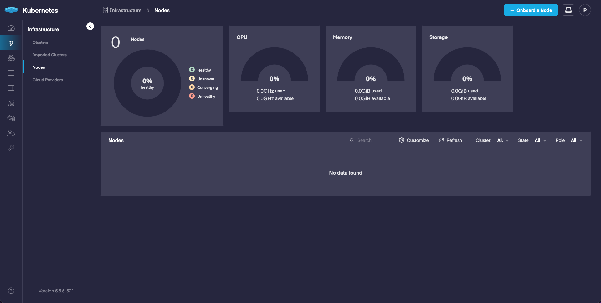
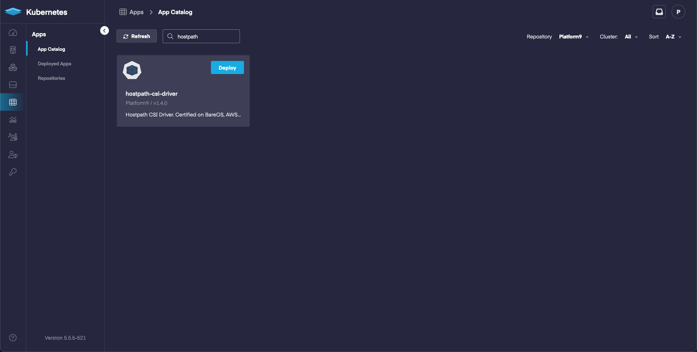
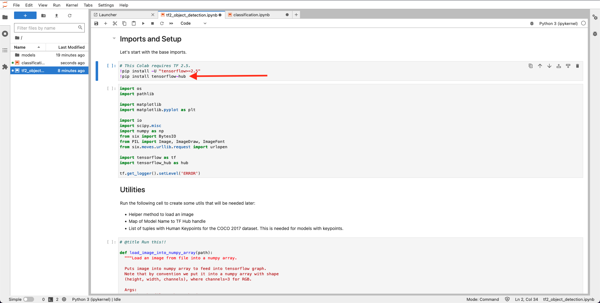

# Kubernetes Academy 101: AI/ML

## What to Expect

We will deploy a Kubernetes cluster using Platform9, deploy hostpath storage, and finally deploy a Jupyter notebook backed by persistent storage.

## Action Items

- Benefits for Machine Learning.
- Deploy a cluster with Platform9 Free Tier.
  - We will deploy a BareOS Cluster
    > Platform9 uses the term ‘BareOS’ to refer to a set of physical or virtual machines in your on-premises infrastructure that have a supported linux operating system installed that can be used to create an on-premises Kubernetes cluster.
- Configure cluster storage with the CSI HostPath driver.
  - Deploy using the App Catalog.
- Deploying a Jupyter notebook in your Kubernetes cluster.
  - Deploy with the default container (<https://jupyter-docker-stacks.readthedocs.io/en/latest/using/selecting.html>)
- Get information about the notebook using Kubernetes commands.
- Access the Notebook using a token.
- Run “Hello, world!” on your Jupyter notebook.
  - Create a new notebook and run Hello, World! Congrats, that was your first notebook on Kubernetes!
- Load an example Tensorflow Tutorial Notebook
  - Run the Notebook and update a section or two.

## Pre-requisites

- BareOS: Bare Metal or VMs running Ubuntu 20.04

- LoadBalancer or NodePort
  - LoadBalancer will require MetalLB being deployed when configuring the cluster.
  - NodePort will not require additional configuration during cluster deployment.

## Kubernetes Benefits

Easily scale up Jupyter notebooks for your users. Give each user access to their own notebook so that they can experiment. Ideally after running a single pod for a Jupyter notebook for testing, we would progress to configuring JupyterHub (<https://zero-to-jupyterhub.readthedocs.io/en/latest/>) to help automate notebooks for our users.

## Deploy a Cluster with Platform9 Free Tier

We are going to start out by deploying a Kubernetes cluster using Platform9.

- Bare Metal: 2-3 Bare Metal Nodes (<https://platform9.com/docs/kubernetes/get-started-bare-metal>)
- VM: with 2-3 Virtual Machines Nodes (<https://platform9.com/docs/kubernetes/get-started-bare-metal>)



We will access the cluster using kubectl, which means we will need to install kubectl (<https://kubernetes.io/docs/tasks/tools/#kubectl>)

## Configure Storage with the CSI HostPath Driver

Now that we have a cluster we will deploy a storage provider so that we can save our work.

This will be done using the App Catalog. The App Catalog will allow us to quickly deploy helm based applications.



## Deploy a Jupyter Notebook

Create a deployment using jupyter/tensorflow-notebook. (<https://jupyter-docker-stacks.readthedocs.io/en/latest/using/selecting.html>)

Examples for two methods, one being NodePort and the other being LoadBalancer.

At this point we can either clone the github repository (<https://github.com/Platform9-Community/ai-ml-workshop>) or you can download/copy the jupyter.yaml file from either the NodePort folder or the LoadBalancer folder under the ai-ml-101 directory.

Once you have the file on your machine, or somewhere that can use kubectl to access the cluster, we can run:

`kubectl create -f jupyter.yaml`

## Access the Notebook

Once the notebook has deployed we can pull the logs to figure out the URL + Token. The Tensorflow image is around 1GB so it can take a few moments for the pod to move into a running state. 

Assuming we are deployed in the default namespace, we can view the status of the pod using:

`kubectl get pods -w`

```bash
$ kubectl get pods
NAME      READY   STATUS    RESTARTS   AGE
jupyter   1/1     Running   0          31m
```

If the original yaml file was modified to use namespaces you would need to specify the namespace:

`kubectl get pods -n NAMESPACE -w`

Once the pod is in a running state we can view the logs:

```bash
$ kubectl logs jupyter
Entered start.sh with args: jupyter lab
Executing the command: jupyter lab
[I 2022-07-26 15:56:07.863 ServerApp] jupyterlab | extension was successfully linked.
[I 2022-07-26 15:56:07.882 ServerApp] nbclassic | extension was successfully linked.
[I 2022-07-26 15:56:07.885 ServerApp] Writing Jupyter server cookie secret to /home/jovyan/.local/share/jupyter/runtime/jupyter_cookie_secret
[I 2022-07-26 15:56:08.302 ServerApp] notebook_shim | extension was successfully linked.
[I 2022-07-26 15:56:08.347 ServerApp] notebook_shim | extension was successfully loaded.
[I 2022-07-26 15:56:08.350 LabApp] JupyterLab extension loaded from /opt/conda/lib/python3.10/site-packages/jupyterlab
[I 2022-07-26 15:56:08.350 LabApp] JupyterLab application directory is /opt/conda/share/jupyter/lab
[I 2022-07-26 15:56:08.359 ServerApp] jupyterlab | extension was successfully loaded.
[I 2022-07-26 15:56:08.367 ServerApp] nbclassic | extension was successfully loaded.
[I 2022-07-26 15:56:08.367 ServerApp] Serving notebooks from local directory: /home/jovyan
[I 2022-07-26 15:56:08.368 ServerApp] Jupyter Server 1.18.1 is running at:
[I 2022-07-26 15:56:08.368 ServerApp] http://jupyter:8888/lab?token=df6d103b0944468bec9eb658184548bdc66bf0cf6e1462a5
[I 2022-07-26 15:56:08.368 ServerApp]  or http://127.0.0.1:8888/lab?token=df6d103b0944468bec9eb658184548bdc66bf0cf6e1462a5
[I 2022-07-26 15:56:08.368 ServerApp] Use Control-C to stop this server and shut down all kernels (twice to skip confirmation).
[C 2022-07-26 15:56:08.373 ServerApp] 
    
    To access the server, open this file in a browser:
        file:///home/jovyan/.local/share/jupyter/runtime/jpserver-7-open.html
    Or copy and paste one of these URLs:
        http://jupyter:8888/lab?token=df6d103b0944468bec9eb658184548bdc66bf0cf6e1462a5
     or http://127.0.0.1:8888/lab?token=df6d103b0944468bec9eb658184548bdc66bf0cf6e1462a5
```

In the example above we are looking for the URL: 

http://jupyter:8888/lab?token=df6d103b0944468bec9eb658184548bdc66bf0cf6e1462a5

- LoadBalancer

  If you are using a LoadBalancer then you can replace `jupyter` with the LoadBalancer IP:

  ```bash
  $ kubectl get service jupyter-headless
  NAME               TYPE           CLUSTER-IP     EXTERNAL-IP     PORT(S)                                        AGE
  jupyter-headless   LoadBalancer   10.21.161.60   192.168.86.10   8888:32765/TCP,7777:30995/TCP,2222:31398/TCP   35m
  ```
  In this example the IP would be the External-IP `192.168.86.10`. 

- NodePort


## Hello World! Example

Create a new notebook and run Hello World!

```python
print("Hello, World!")
```

## Tensorflow Example Notebook

Download the notebook from (<https://www.tensorflow.org/tutorials/images/classification>)

Download the notebook from (<https://www.tensorflow.org/hub/tutorials/tf2_object_detection>)

Once one of the notebooks have been downloaded we can upload the notebook. At this point we will upload the notebook, open it, and then restart and run the notebook.

- If you are using the object detection notebook then you will need to update the line that installs tensorflow to also install tensorflow-hub as your image only includes tensorflow.
  - `!pip install tensorflow-hub`



There are a couple of helpful commands that we can run when the notebook is working through each section. There are a few sections that will increase the memory and cpu usage. To see what kind of impact this is having on your nodes you can run:

```bash
$ kubectl top nodes
NAME            CPU(cores)   CPU%   MEMORY(bytes)   MEMORY%   
192.168.86.71   375m         9%     1587Mi          20%       
192.168.86.72   638m         15%    2180Mi          28%       
192.168.86.73   2091m        52%    7049Mi          91%       
```